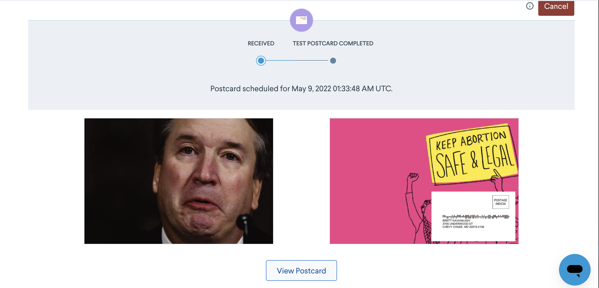

## Mail your Government Script

This is a demo script of how you could send a postcard to your governement representatives anonymously.


## How to use this script

Head to Lob.com and create an account, add a credit card and grab an API key.

Then add your API key to the top of send_hundreds.js or send_single.js with your API key

Run npm install


Then if you want to send a single letter run 
```
node send_single.js
```

To send someone hundreds of letters:
```
no send_hundreds.js
```

## Viewing Results

You can view your results by heading to the Lob dashboard and you should see something like this postcard I sent in a test env:



Make sure to use a live API key to actually send the postcard out.

